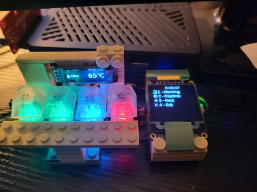
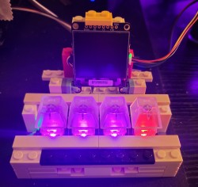
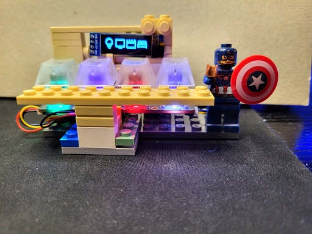
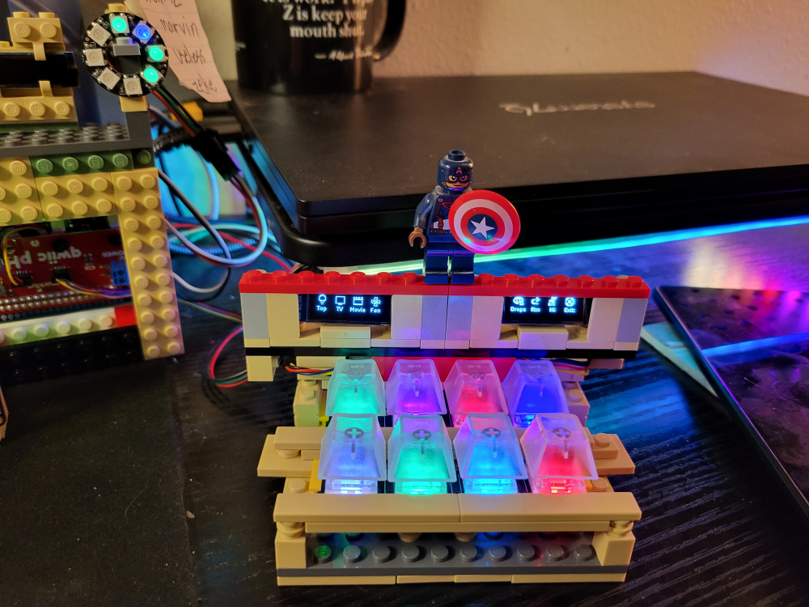

# I2C Button Board

The world's most expensive remote control for HomeAssistant. Uses

- [HAssK client](https://github.com/EAGrahamJr/HAssK)
- [kobots-devices](https://github.com/EAGrahamJr/kobots-devices)
  - and by extension [diozero](https://www.diozero.com/)
- Lightbend's [Typesafe config](https://github.com/lightbend/config) for the configuration.

### Cost

And counting (discounting the LEGO pieces):

| Item                                      |      ~Price |
|-------------------------------------------|------------:|
| Raspberry Pi 4 (ref Covid) |     $225.00 |
| SparkFun Qwiic pHat v2                    |       $8.00 |
| 128x128 OLED display                      |      $23.00 |
| I2C Multiplexer                           |       $7.00 |
| 128x32 OLED display x 2                   |       $8.00 |
| NeoKey 1x4 I2C x 2                        |      $20.00 |
| Keys (4 x 2)                              |       $7.00 |
| Key caps (4 x 2)                          |       $5.00 |
| Neopixel strip, 1/2 meter                 |      $13.00 |
| Neopixel ring (8 pixels)                  |       $4.00 |
| Neopixel controller                       |       $8.00 |
| Extra STEMMA cables                       |      $12.00 |
| **TOTAL**                                 | **$340.00** |

### V1, Mk 2

- The secondary screen shows a continually updating list of temperatures (rooms, CPU, and "outside").
- Each button corresponds to a menu selection on the larger screen (next/prev buttons on others)
- Also has a "sleep" mode to prevent screen burn in (from Mk 1) 
  - Exit button is active, others just "wake up" the menu

### V2

There were some timing issues, as well as the buttons not responding quickly. This was also a case of trying to do too
much for no real reason.

- Mode defined for time of day
- Single icon display for each button based on mode/action
- Button colors corespond to icons (more or less)
- Button actions based on mode
- Neopixel strip just runs on its own
  - shutdown actually works now (?)
- App exit on multiple buttons pressed
- Snazzy minifig to help hold the I2C cable

### V5

**MORE BUTTONS!!! MORE SCREEN!!! MORE JUNK!!!***

Added an I2C multiplexer and a lot more "self-handling" code. The "front bench" of buttons is configurable by an external signal because I don't have a rotary encoder (yet). The NeoPixel ring shows "liveness" of various hosts and there's a NeoPixel strip just for (more) color.
