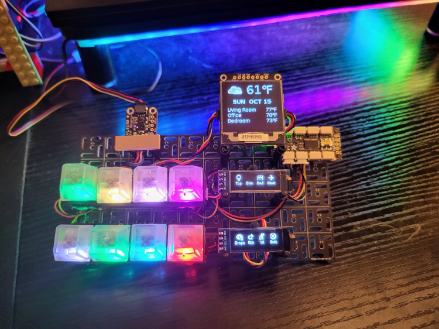
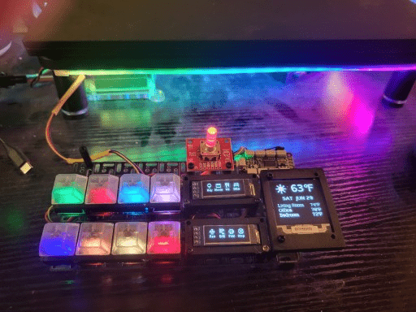

# I2C Button Board

The world's most expensive remote control for HomeAssistant. Uses

- [HAssK client](https://github.com/EAGrahamJr/HAssK)
- [kobots-devices](https://github.com/EAGrahamJr/kobots-devices)
  - and by extension [diozero](https://www.diozero.com/)
- Lightbend's [Typesafe config](https://github.com/lightbend/config) for the configuration.
- [Kobots "Parts"](https://github.com/EAGrahamJr/kobots-parts) for application management, control, and all the pretty graphical elements.

### Cost

Does **not** count the Raspberry Pi, as it's been swapped out a few times.

| Item                      |   ~Price |
|---------------------------|---------:|
| SparkFun Qwiic pHat v2    |       $8 |
| 128x128 OLED display      |      $23 |
| I2C Multiplexer           |       $7 |
| 128x32 OLED display x 2   |       $8 |
| NeoKey 1x4 I2C x 2        |      $20 |
| Keys (4 x 2)              |       $7 |
| Key caps (4 x 2)          |       $5 |
| Neopixel strip, 1/2 meter |      $13 |
| Neopixel ring (8 pixels)  |       $4 |
| Neopixel controller       |       $8 |
| SparkFun Qwiic Twist      |      $25 |
| Swirly board              |      $11 |
| Extra STEMMA cables       |      $12 |
| **TOTAL**                 | **$151** |

### V1, Mk 2

- The secondary screen shows a continually updating list of temperatures (rooms, CPU, and "outside").
- Each button corresponds to a menu selection on the larger screen (next/prev buttons on others)
- Also has a "sleep" mode to prevent screen burn in (from Mk 1) 
  - Exit button is active, others just "wake up" the menu

### V2

There were some timing issues, as well as the buttons not responding quickly. This was also a case of trying to do too
much for no real reason.

- Mode defined for time of day
- Single icon display for each button based on mode/action
- Button colors corespond to icons (more or less)
- Button actions based on mode
- Neopixel strip just runs on its own
  - shutdown actually works now (?)
- App exit on multiple buttons pressed
- Snazzy minifig to help hold the I2C cable

### V5

**MORE BUTTONS!!! MORE SCREEN!!! MORE JUNK!!!***

Added an I2C multiplexer and a lot more "self-handling" code. The "front bench" of buttons is configurable by an external signal because I don't have a rotary encoder (yet). The NeoPixel ring shows "liveness" of various hosts and there's a NeoPixel strip just for (more) color.

### V6

ToF to handle menu switching and built on a "swirly plate" for a new **`Industrial`** look.

### V7+

This is likely the last hardware iteration as it's now quite easy to re-arrange buttons on whims...

Removed ToF (not working that well), re-arranged stuff and added some 3D printed frames to make it look less janky. Added the rotary encoder for additional media support when I get to it.

And, just for grins, added a ["Matrix Rain" animation](make-it-rain.mp4) (from the `kobots-parts` library).

#### Prints

- Frame for large OLED - https://www.printables.com/model/923637-15-oled-frame-for-m25
- Cover for NeoKeys - https://www.printables.com/model/904353-neokey-1x4-cover
- Frame for small OLED - https://www.printables.com/model/927362-ssd-1306-frame
